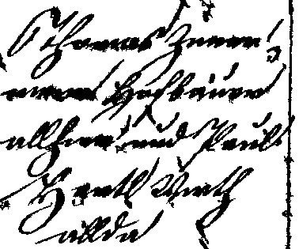

# Enhancement Tool

## Visual Computing Group (VCG) 
## Democritus University of Thrace (DUTH)

In the frame of “READ” project, document image enhancement tools have been implemented to be used as a preprocessing stage for the binarisation algorithm. After experimental work, the enhancement tools consists of two different modules. 

The first module is an anisotropic diffusion process or also called Perona–Malik diffusion [Perona1987].  It is a procedure aiming at reducing image noise without removing significant parts of the image content - typically edges.

The second module is inspired by adopts the characteristics of the ganglion cells of the Hu-man Visual System (HVS) [Nelson2004, Vonikakis2011]. It can deal with various types of degradations, such as uneven illumination, shadows, low contrast, smears, and heavy noise densities. 

The document image enhancement tool is developed in C++11 and it is available at github under LGPL-3.0

Original Document | Binarization
-------------------------------|--------------------------
 | 
Enhancement | Binarisation after enhancement
 | 

*Usage*: enhancement [infile] [outfile]

Go [here](https://github.com/Transkribus/VCG-DUTH-ImageBinarisationTool) for the Binarization Code:  

## References

[Nelson2004] Nelson R, Kolb H (2004) ON and OFF pathways in the vertebrate retina and visual system. In: Chalupa LM, Werner JS (eds) The visual neurosciences. MIT Press, Cambridge, pp 260–278

[Perona1987] Pietro Perona and Jitendra Malik. 1987. "Scale-space and edge detection using anisotropic diffusion". Proceedings of IEEE Computer Society Workshop on Com-puter Vision,. pp. 16–22.

[Vonikakis2011] Vonikakis, V., Andreadis, I., & Papamarkos, N. (2011). Robust document bi-narisation with OFF center-surround cells. Pattern Analysis and Applications, 14(3), 219-234.

